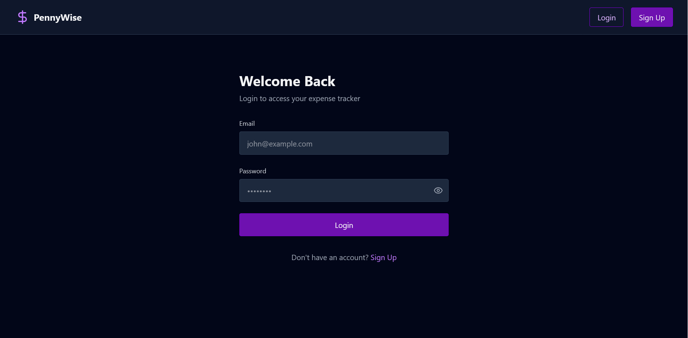
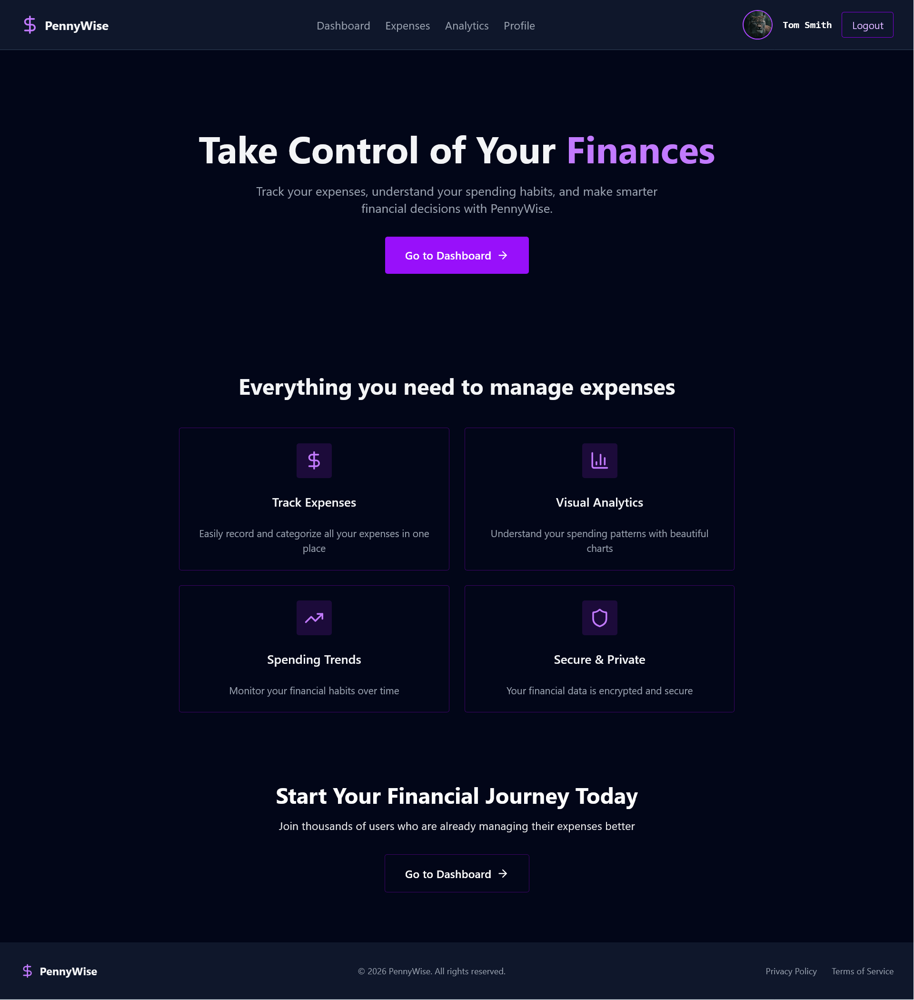
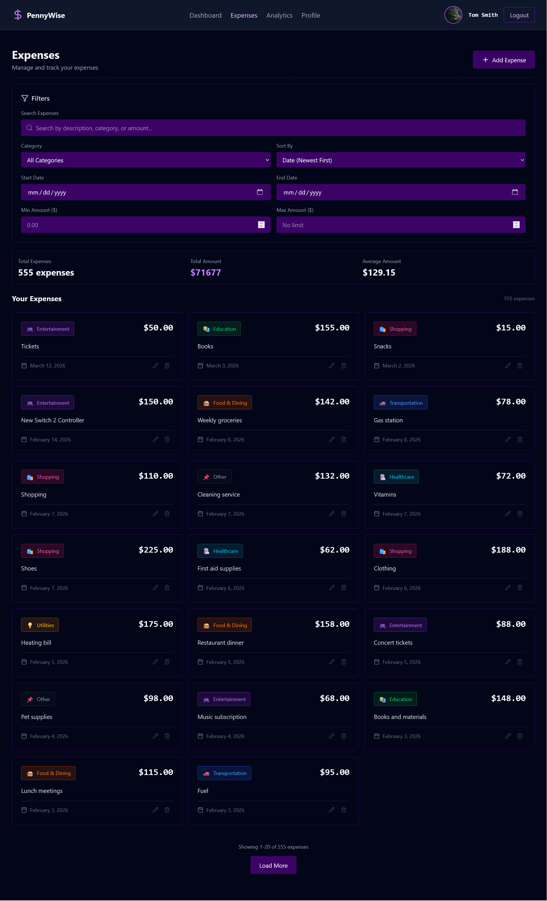
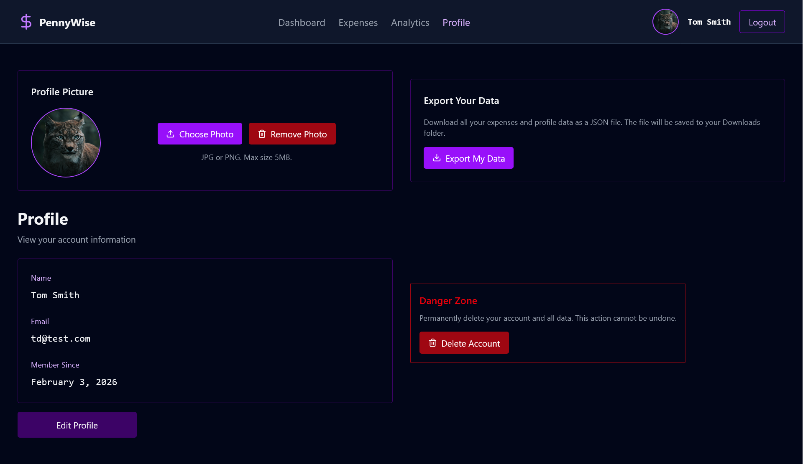
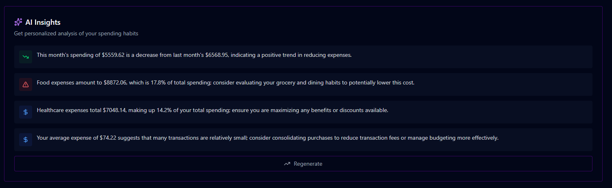

# 💰 PennyWise — MERN Full Stack Expense Tracker

A secure, full-stack personal finance application built with MongoDB, Express, React, and Node.js. PennyWise allows users to track expenses, visualize spending patterns through interactive charts, get AI-powered financial insights, and manage their financial data — all behind a secure JWT-authenticated API.

## Demo Account

You can log in with the following credentials to explore the app with pre-loaded data:

| Field    | Value                |
| -------- | -------------------- |
| Email    | `demo@pennywise.app` |
| Password | `Demo#1234`          |

## Features

- **AI-Powered Insights** — On-demand financial analysis powered by OpenAI (GPT-4o mini), delivering personalized spending insights based on your real expense data
- **User Authentication** — Secure sign up and login with JWT tokens
- **Password Security** — bcrypt hashing for safe password storage
- **Protected Routes** — Middleware-based route protection on both frontend and backend
- **Expense Management** — Full CRUD: create, read, update, and delete expenses
- **Category System** — 8 expense categories: Food & Dining, Transportation, Utilities, Entertainment, Healthcare, Shopping, Education, and Other
- **Advanced Filtering** — Filter expenses by category, date range, amount range, and search term
- **Dashboard Overview** — Stats cards, spending pie chart, trend line chart, and recent expenses
- **Analytics Dashboard** — Deep insights including yearly breakdowns, category comparisons, monthly overviews, and spending insights
- **Lazy Loading** — Year sections on the analytics page load on scroll via IntersectionObserver
- **Profile Management** — Update name, email, and password
- **Avatar Upload** — Upload, preview, and delete profile pictures (JPG/PNG, max 5MB)
- **Data Export** — Download all expenses and profile data as a JSON file
- **Account Deletion** — Permanently delete account and all associated data

## Technologies Used

### Frontend

- **React 19** — UI library
- **TypeScript** — Type safety
- **Vite** — Build tool and dev server
- **TanStack Router** — File-based routing with type safety
- **Zustand** — Lightweight global state management
- **Axios** — HTTP client
- **Recharts** — Interactive charts and data visualization
- **Tailwind CSS v4** — Utility-first styling
- **Lucide React** — Icon library

### Backend

- **Node.js** — Runtime environment
- **Express 5** — Web framework
- **TypeScript** — Type safety
- **MongoDB** — NoSQL database
- **Mongoose** — MongoDB object modeling
- **JWT** — JSON Web Tokens for authentication
- **bcryptjs** — Password hashing
- **OpenAI SDK** — GPT-4o mini integration for AI-powered expense analysis
- **Multer** — Avatar file upload handling
- **CORS** — Cross-origin resource sharing
- **dotenv** — Environment variable management
- **tsx + nodemon** — TypeScript execution and hot reloading

## Live App

<a href="https://pennywise-ajfm88.netlify.app"></a>
<a href="https://pennywise-backend-ajfm88.onrender.com"></a>

## Screenshots

| Page        | Preview                                                 |
| ----------- | ------------------------------------------------------- |
| Sign Up     |        |
| Login       |          |
| Home        |            |
| Dashboard   |  |
| Expenses    |    |
| Analytics   |  |
| Profile     |      |
| AI Insights |        |
| Tech Stack  |                   |

## Prerequisites

Before you begin, ensure you have the following installed:

- **Node.js** (v18 or higher)
- **MongoDB** (v6 or higher) — [Installation Guide](https://www.youtube.com/watch?v=gB6WLkSrtJk)
- **npm** or **yarn**

## Project Structure

```
MERN-Full-Stack-PennyWise-App/
├── client/
│   ├── src/
│   │   ├── components/
│   │   │   ├── Analytics/
│   │   │   │   ├── AIInsightsCard.tsx
│   │   │   │   ├── AllYearsChart.tsx
│   │   │   │   ├── CategoryTable.tsx
│   │   │   │   ├── CurrentMonthBarChart.tsx
│   │   │   │   ├── DynamicYearSection.tsx
│   │   │   │   ├── InsightsCard.tsx
│   │   │   │   ├── LazyLoadSection.tsx
│   │   │   │   ├── SummaryCard.tsx
│   │   │   │   ├── YearCategoryChart.tsx
│   │   │   │   ├── YearlyCategoryChart.tsx
│   │   │   │   ├── YearlyOverviewChart.tsx
│   │   │   │   └── YearSelector.tsx
│   │   │   ├── Auth/
│   │   │   │   ├── LoginForm.tsx
│   │   │   │   └── SignupForm.tsx
│   │   │   ├── Common/
│   │   │   │   ├── Avatar.tsx
│   │   │   │   └── Navigation.tsx
│   │   │   ├── Dashboard/
│   │   │   │   ├── CategoryPieChart.tsx
│   │   │   │   ├── DateRangeSelector.tsx
│   │   │   │   ├── RecentExpenseItem.tsx
│   │   │   │   ├── StatsCard.tsx
│   │   │   │   └── TrendLineChart.tsx
│   │   │   ├── Expenses/
│   │   │   │   ├── AmountRangeFilter.tsx
│   │   │   │   ├── DateRangeFilter.tsx
│   │   │   │   ├── DeleteConfirmationModal.tsx
│   │   │   │   ├── ExpenseCard.tsx
│   │   │   │   ├── ExpenseForm.tsx
│   │   │   │   ├── ExpenseModal.tsx
│   │   │   │   ├── ExpensesFilters.tsx
│   │   │   │   ├── ExpensesList.tsx
│   │   │   │   ├── FilterChips.tsx
│   │   │   │   ├── Pagination.tsx
│   │   │   │   ├── ResultsSummary.tsx
│   │   │   │   └── SearchBar.tsx
│   │   │   ├── Home/
│   │   │   │   ├── CTASection.tsx
│   │   │   │   ├── FeatureCard.tsx
│   │   │   │   ├── FeaturesSection.tsx
│   │   │   │   ├── Footer.tsx
│   │   │   │   └── HeroSection.tsx
│   │   │   └── Profile/
│   │   │       ├── AvatarUpload.tsx
│   │   │       ├── DeleteAccountModal.tsx
│   │   │       ├── ExportDataButton.tsx
│   │   │       ├── ProfileEditForm.tsx
│   │   │       └── ProfileView.tsx
│   │   ├── pages/
│   │   │   ├── AnalyticsPage.tsx
│   │   │   ├── DashboardPage.tsx
│   │   │   ├── ExpensesPage.tsx
│   │   │   ├── HomePage.tsx
│   │   │   ├── LoginPage.tsx
│   │   │   ├── ProfilePage.tsx
│   │   │   └── SignupPage.tsx
│   │   ├── routes/
│   │   │   ├── __root.tsx
│   │   │   ├── analytics.tsx
│   │   │   ├── dashboard.tsx
│   │   │   ├── expenses.tsx
│   │   │   ├── index.tsx
│   │   │   ├── login.tsx
│   │   │   ├── profile.tsx
│   │   │   └── signup.tsx
│   │   ├── services/
│   │   │   ├── analyticsService.ts
│   │   │   ├── api.ts
│   │   │   ├── authService.ts
│   │   │   └── expenseService.ts
│   │   ├── store/
│   │   │   ├── analyticsStore.ts
│   │   │   ├── authStore.ts
│   │   │   ├── backendStore.ts
│   │   │   └── expenseStore.ts
│   │   ├── types/
│   │   │   ├── analytics.types.ts
│   │   │   ├── auth.types.ts
│   │   │   ├── expense.types.ts
│   │   │   └── index.ts
│   │   ├── utils/
│   │   │   ├── CategoryConfig.ts
│   │   │   └── getInitials.ts
│   │   ├── App.tsx
│   │   ├── index.css
│   │   ├── main.tsx
│   │   ├── routeTree.gen.ts
│   │   └── vite-env.d.ts
│   ├── .env
│   ├── .gitignore
│   ├── eslint.config.js
│   ├── index.html
│   ├── package.json
│   ├── README.md
│   ├── tsconfig.app.json
│   ├── tsconfig.json
│   ├── tsconfig.node.json
│   ├── tsr.config.json
│   └── vite.config.ts
├── server/
│   ├── src/
│   │   ├── config/
│   │   │   └── db.ts
│   │   ├── controllers/
│   │   │   ├── aiControllers.ts
│   │   │   ├── analyticsControllers.ts
│   │   │   ├── authControllers.ts
│   │   │   ├── expenseControllers.ts
│   │   │   └── profileControllers.ts
│   │   ├── middleware/
│   │   │   ├── authMiddleware.ts
│   │   │   ├── errorHandler.ts
│   │   │   └── upload.ts
│   │   ├── models/
│   │   │   ├── Expense.ts
│   │   │   └── User.ts
│   │   ├── routes/
│   │   │   ├── aiRoutes.ts
│   │   │   ├── analyticsRoutes.ts
│   │   │   ├── authRoutes.ts
│   │   │   ├── expenseRoutes.ts
│   │   │   └── profileRoutes.ts
│   │   ├── types/
│   │   │   └── index.ts
│   │   ├── utils/
│   │   │   ├── responseHelpers.ts
│   │   │   └── tokenHelpers.ts
│   │   ├── index.ts
│   │   └── mongoDBTestConnection.ts
│   ├── uploads/
│   │   └── avatars/
│   ├── .env
│   ├── .gitignore
│   ├── nodemon.json
│   ├── package.json
│   ├── README.md
│   └── tsconfig.json
├── -readme-pics/
│   ├── 01-Signup-PennyWise.png
│   ├── 02-Login-PennyWise.png
│   ├── 03-Home-PennyWise.png
│   ├── 04-Dashboard-PennyWise.png
│   ├── 05-Expenses-PennyWise.png
│   ├── 06-Analytics-PennyWise.png
│   ├── 07-Profile-PennyWise.png
│   ├── 08-AI-Insights.png
│   └── mern.png
└── README.md
```

## Getting Started

### 1. Download/Clone the Repository

### 2. Set Up the Server

```bash
cd server
npm install
```

Create a `.env` file in the `server/` directory:

```env
PORT=8000
MONGODBURI=mongodb://localhost:27017/pennywise
JWT_SECRET=your-secure-jwt-secret-key
NODE_ENV=development
OPENAI_API_KEY=your-openai-api-key
```

Start MongoDB, then run the server:

```bash
npm run dev
```

The API will be available at `http://localhost:8000`

### 3. Set Up the Client

Open a new terminal:

```bash
cd client
npm install
```

Create a `.env` file in the `client/` directory:

```env
VITE_API_BASE_URL=http://localhost:8000/api
```

Start the frontend:

```bash
npm run dev
```

The app will be available at `http://localhost:3000`

## API Endpoints

### Public Routes

| Method | Endpoint           | Description                   |
| ------ | ------------------ | ----------------------------- |
| POST   | `/api/auth/signup` | Register a new user           |
| POST   | `/api/auth/login`  | Login and receive a JWT token |

### Expense Routes (Protected)

| Method | Endpoint            | Description                                           |
| ------ | ------------------- | ----------------------------------------------------- |
| GET    | `/api/expenses`     | Get all expenses (supports `?category=` and `?sort=`) |
| GET    | `/api/expenses/:id` | Get a single expense                                  |
| POST   | `/api/expenses`     | Create a new expense                                  |
| PUT    | `/api/expenses/:id` | Update an expense                                     |
| DELETE | `/api/expenses/:id` | Delete an expense                                     |

### Profile Routes (Protected)

| Method | Endpoint               | Description                             |
| ------ | ---------------------- | --------------------------------------- |
| GET    | `/api/profile`         | Get current user profile                |
| PUT    | `/api/profile`         | Update name, email, or password         |
| POST   | `/api/profile/avatar`  | Upload a profile picture                |
| GET    | `/api/profile/avatar`  | Get profile picture                     |
| DELETE | `/api/profile/avatar`  | Delete profile picture                  |
| DELETE | `/api/profile/account` | Permanently delete account and all data |
| GET    | `/api/profile/export`  | Export all data as JSON                 |

### Analytics Routes (Protected)

| Method | Endpoint                                 | Description                                    |
| ------ | ---------------------------------------- | ---------------------------------------------- |
| GET    | `/api/analytics/dashboard`               | Total, count, average, this month stats        |
| GET    | `/api/analytics/category`                | Spending totals grouped by category            |
| GET    | `/api/analytics/trends`                  | Monthly spending over the last 6 months        |
| GET    | `/api/analytics/period?days=`            | Category breakdown for a custom time period    |
| GET    | `/api/analytics/current-month`           | Category breakdown for the current month       |
| GET    | `/api/analytics/monthly?year=`           | Monthly totals for a specific year             |
| GET    | `/api/analytics/yearly-categories?year=` | Monthly category breakdown for a specific year |
| GET    | `/api/analytics/all-years`               | Total spending grouped by year                 |

### AI Routes (Protected)

| Method | Endpoint           | Description                                      |
| ------ | ------------------ | ------------------------------------------------ |
| GET    | `/api/ai/insights` | Generate AI-powered spending insights via OpenAI |

## Authorization

All protected routes require a valid JWT token. Pass it in the request header:

```
Authorization: Bearer <your_token>
```

You receive the token in the response body upon successful login.

## Database Schema

### Users Collection

```
{
  _id: ObjectId,
  name: String,
  email: String (unique),
  password: String (bcrypt hashed),
  avatar: String (optional, filename),
  createdAt: Date,
  updatedAt: Date
}
```

### Expenses Collection

```
{
  _id: ObjectId,
  userId: ObjectId (ref: User),
  amount: Number,
  category: String (food | transport | utilities | entertainment | healthcare | shopping | education | other),
  description: String,
  date: Date,
  createdAt: Date,
  updatedAt: Date
}
```

---

### Tutorial

This projects is a heavily modified version of the following tutorial:

<a href="https://www.youtube.com/watch?v=2Wl-uPl2hyY"></a>
